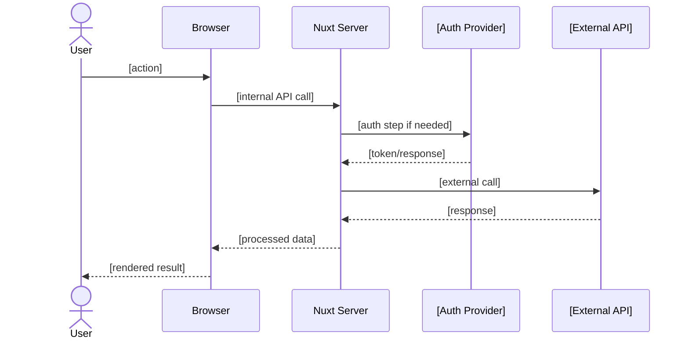
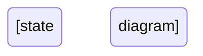

# Flow Diagrams: [FEATURE NAME]

**Feature Branch**: `[###-feature-name]`
**Created**: [DATE]

## Primary Flow

<!--
  Mermaid sequence diagram showing the main happy path for this feature.
  Include all actors: User, Browser (Vue/Nuxt client), Server (Nitro),
  external APIs, auth providers.
-->



## Error / Retry Flow

<!--
  Show what happens on auth failure, API error, network timeout, etc.
  Only include if the feature has non-trivial error handling.
-->

```mermaid
sequenceDiagram
    [error flow diagram]
```

## State Diagram

<!--
  Optional: If the feature involves state transitions (e.g., connection states,
  processing stages), include a state diagram.
  Remove this section if not applicable.
-->


