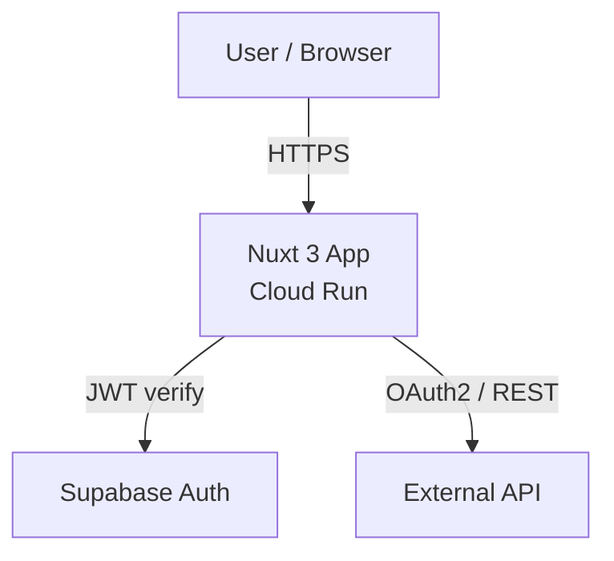
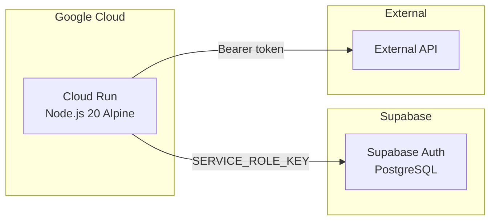

# Architecture Overview

<!--
  This file is maintained by Speckit. Update when a feature impacts the global architecture.
  Use Mermaid diagrams for visual representation.
-->

## System Context

## Deployment

## Key Components

| Component | Location | Responsibility |
|---|---|---|
| Client middleware | `middleware/auth.global.ts` | Redirect to login if unauthenticated |
| Server middleware | `server/middleware/auth.ts` | Verify JWT on API routes |
| API client | `server/utils/<api>-client.ts` | Centralized external API calls with auth + retry |
| Token manager | `server/utils/tokenManager.ts` | In-memory token cache with auto-refresh |
