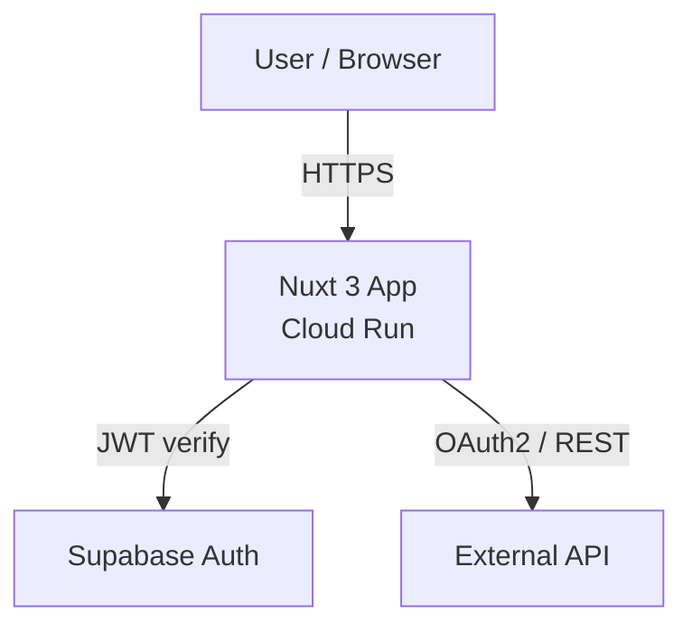
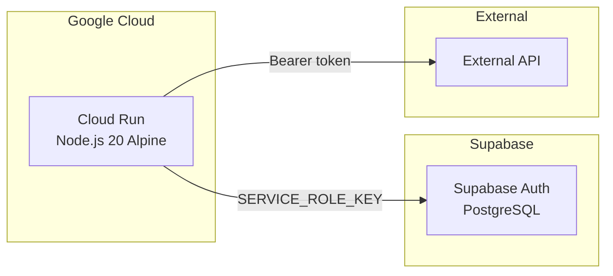
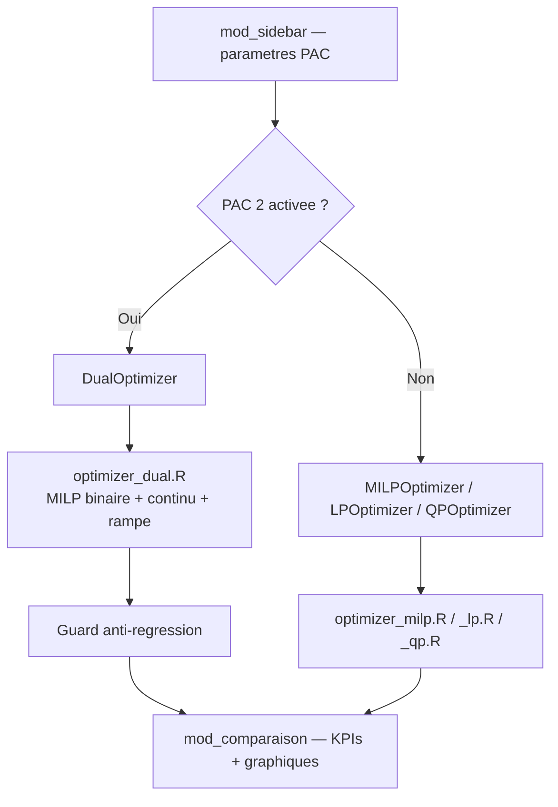
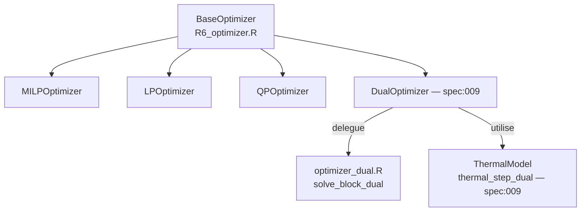

# Architecture Overview

<!--
  This file is maintained by Speckit. Update when a feature impacts the global architecture.
  Use Mermaid diagrams for visual representation.
-->

## System Context

```mermaid
graph TB
    User[User / Browser]
    App[Nuxt 3 App<br/>Cloud Run]
    Auth[Supabase Auth]
    API[External API]

    User -->|HTTPS| App
    App -->|JWT verify| Auth
    App -->|OAuth2 / REST| API
```

## Deployment

```mermaid
graph LR
    subgraph Google Cloud
        CR[Cloud Run<br/>Node.js 20 Alpine]
    end
    subgraph Supabase
        SB[Supabase Auth<br/>PostgreSQL]
    end
    subgraph External
        EXT[External API]
    end

    CR -->|SERVICE_ROLE_KEY| SB
    CR -->|Bearer token| EXT
```

## Key Components

| Component | Location | Responsibility |
|---|---|---|
| Client middleware | `middleware/auth.global.ts` | Redirect to login if unauthenticated |
| Server middleware | `server/middleware/auth.ts` | Verify JWT on API routes |
| API client | `server/utils/<api>-client.ts` | Centralized external API calls with auth + retry |
| Token manager | `server/utils/tokenManager.ts` | In-memory token cache with auto-refresh |

---

## PAC Optimizer — R Shiny Application [spec:009]

This project is an R Shiny application (not Nuxt). The section below describes its specific architecture.

### Solver Strategy

```mermaid
graph TD
    UI[mod_sidebar — parametres PAC] --> Dispatch{PAC 2 activee ?}
    Dispatch -- Non --> Mono[MILPOptimizer / LPOptimizer / QPOptimizer]
    Dispatch -- Oui --> Dual[DualOptimizer]
    Dual --> MILP_D[optimizer_dual.R\nMILP binaire + continu + rampe]
    Mono --> MILP_M[optimizer_milp.R / _lp.R / _qp.R]
    MILP_D --> Guard[Guard anti-regression]
    Guard --> Results[mod_comparaison — KPIs + graphiques]
    MILP_M --> Results
```

### R6 Class Hierarchy

```mermaid
graph TD
    Base[BaseOptimizer\nR6_optimizer.R] --> MILP[MILPOptimizer]
    Base --> LP[LPOptimizer]
    Base --> QP[QPOptimizer]
    Base --> Dual[DualOptimizer — spec:009]
    Dual -->|delegue| DualSolver[optimizer_dual.R\nsolve_block_dual]
    Dual -->|utilise| Thermal[ThermalModel\nthermal_step_dual — spec:009]
```

### Key Components (R Shiny)

| Component | Location | Responsibility | Since |
|---|---|---|---|
| BaseOptimizer | `R/R6_optimizer.R` | Logique commune : blocs, fallback, interface resultats | pre-009 |
| MILPOptimizer | `R/R6_optimizer.R` | Solveur MILP mono-PAC on/off | pre-009 |
| LPOptimizer | `R/R6_optimizer.R` | Solveur LP mono-PAC | pre-009 |
| QPOptimizer | `R/R6_optimizer.R` | Solveur QP mono-PAC avec lissage quadratique | pre-009 |
| DualOptimizer | `R/R6_optimizer.R` | Solveur dual ASHP+GSHP, 2 passes COP, guard anti-regression | spec:009 |
| solve_block_dual | `R/optimizer_dual.R` | MILP mixte binaire+continu+rampe pour deux PAC | spec:009 |
| ThermalModel | `R/R6_thermal_model.R` | Dynamique thermique du ballon ; etendu avec thermal_step_dual | spec:009 |
| DataGenerator | `R/R6_data_generator.R` | Generation donnees sim ; etendu avec proxy T_sol | spec:009 |
| calc_cop_gshp | `R/fct_helpers.R` | Fonction COP eau/eau dependant de T_sol | spec:009 |
| mod_sidebar | `R/mod_sidebar.R` | UI parametres PAC 1 + PAC 2 (toggle, puissance, type, mode) | spec:009 |
| mod_comparaison | `R/mod_comparaison.R` | KPIs et graphiques ; ventilation PAC 1 / PAC 2 | spec:009 |
