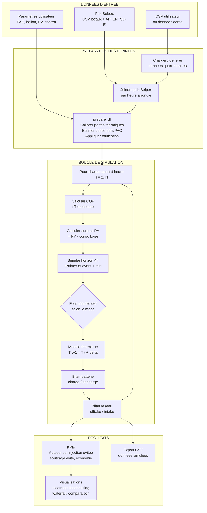
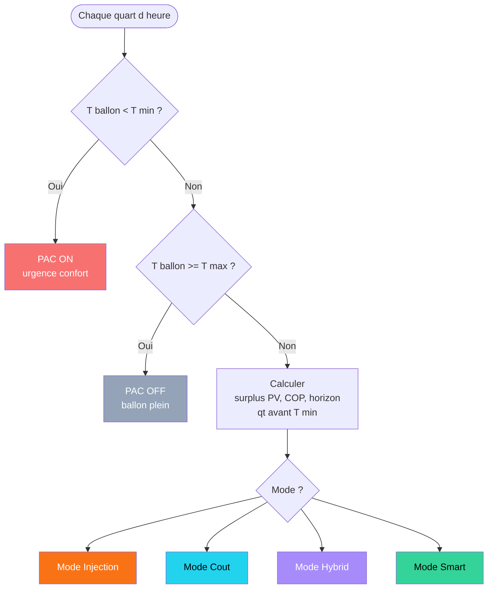
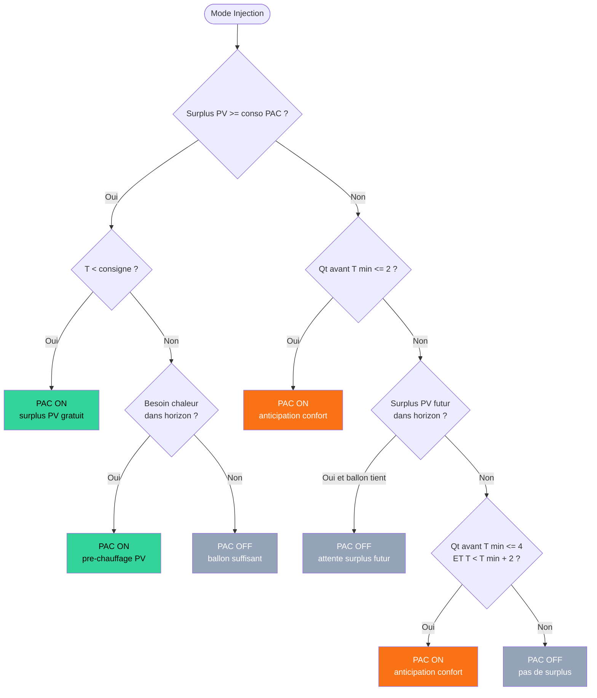
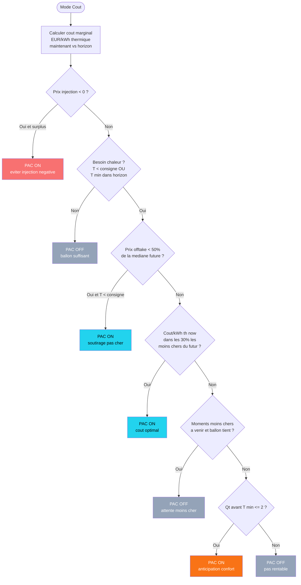
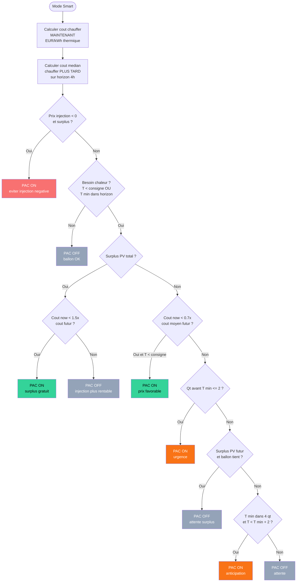
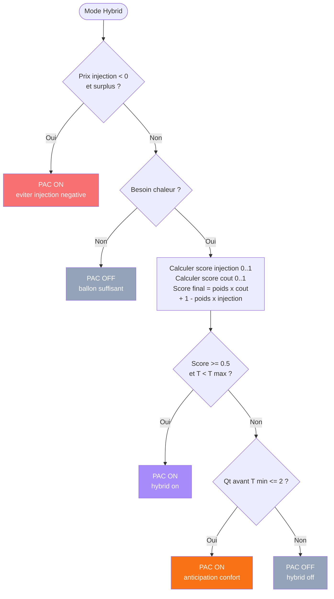
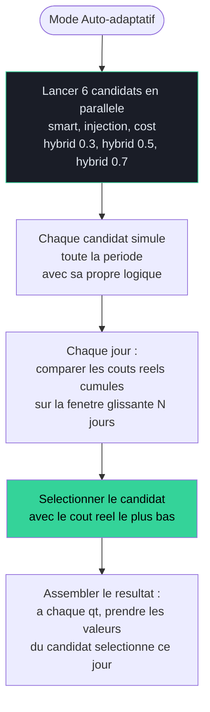
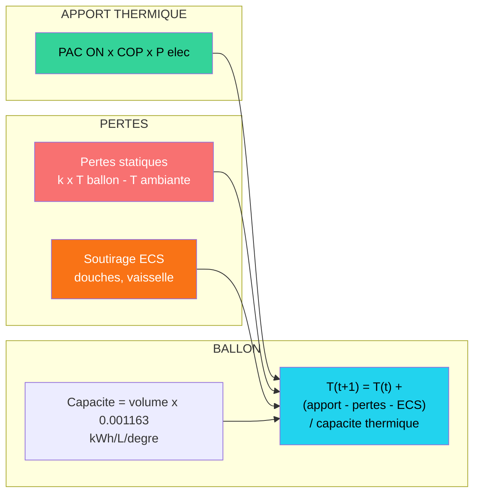
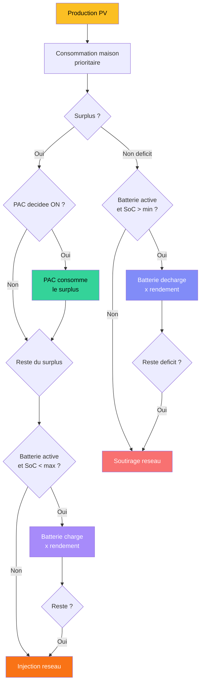
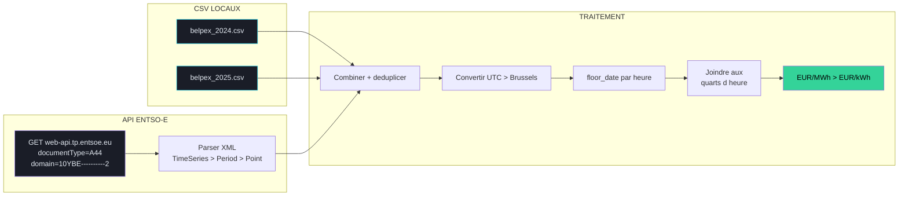

# PAC Optimizer — Diagramme de logique metier

## 1. Pipeline global de simulation

## 2. Garde-fous communs a tous les modes

## 3. Mode INJECTION

## 4. Mode COUT

## 5. Mode SMART (valeur nette)

## 6. Mode HYBRID

## 7. Mode AUTO-ADAPTATIF

## 8. Modele thermique du ballon

## 9. Bilan electrique et cascade de priorite

## 10. Pipeline des prix Belpex

## Legende des couleurs

| Couleur | Signification |
|---------|--------------|
| Vert | PAC ON sur surplus PV (gratuit) ou decision favorable |
| Orange | PAC ON par anticipation/urgence (soutirage reseau) |
| Rouge | PAC ON forcee (urgence confort) ou perte |
| Cyan | Decision basee sur le cout |
| Violet | Mode hybrid |
| Gris | PAC OFF |
