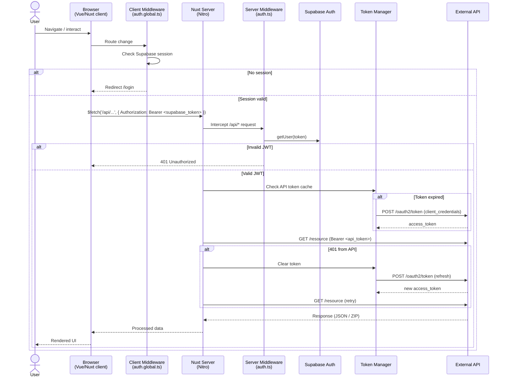

# Global Request Flow

<!--
  End-to-end sequence diagram showing how a typical request flows through the app.
  Updated by Speckit when a feature modifies the global flow.
-->

```mermaid
sequenceDiagram
    actor User
    participant Browser as Browser<br/>(Vue/Nuxt client)
    participant CM as Client Middleware<br/>(auth.global.ts)
    participant Server as Nuxt Server<br/>(Nitro)
    participant SM as Server Middleware<br/>(auth.ts)
    participant SB as Supabase Auth
    participant TM as Token Manager
    participant API as External API

    User->>Browser: Navigate / interact
    Browser->>CM: Route change
    CM->>CM: Check Supabase session
    alt No session
        CM-->>Browser: Redirect /login
    else Session valid
        Browser->>Server: $fetch('/api/...', { Authorization: Bearer <supabase_token> })
        Server->>SM: Intercept /api/* request
        SM->>SB: getUser(token)
        alt Invalid JWT
            SM-->>Browser: 401 Unauthorized
        else Valid JWT
            Server->>TM: Check API token cache
            alt Token expired
                TM->>API: POST /oauth2/token (client_credentials)
                API-->>TM: access_token
            end
            Server->>API: GET /resource (Bearer <api_token>)
            alt 401 from API
                Server->>TM: Clear token
                TM->>API: POST /oauth2/token (refresh)
                API-->>TM: new access_token
                Server->>API: GET /resource (retry)
            end
            API-->>Server: Response (JSON / ZIP)
            Server-->>Browser: Processed data
            Browser-->>User: Rendered UI
        end
    end
```
