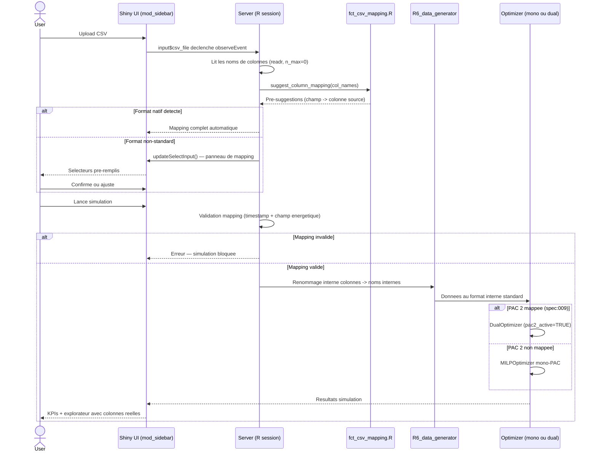

# Flow: Import CSV et pre-suggestion du mapping

**Source spec**: [spec:010] `specs/010-csv-column-mapping/`
**Composants impliques**: mod_sidebar, fct_csv_mapping.R, R6_data_generator, DualOptimizer (spec:009)
**Created**: 2026-06-02

Ce flux est marque cross-spec car il constitue le point d'entree de toutes les donnees CSV dans l'application. Il conditionne le comportement du pipeline de simulation (spec:009 DualOptimizer inclus) selon le contenu du mapping.

## Flux principal

## Liens vers specs

- Detail complet du mapping : `specs/010-csv-column-mapping/flows.md`
- Simulation duale (apres mapping PAC 2) : `specs/009-dual-pac-optimizer/flows.md`
- Regles metier du mapping : `specs/010-csv-column-mapping/business-logic.md`
