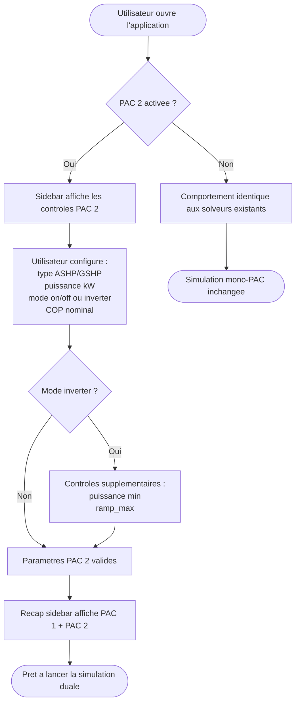
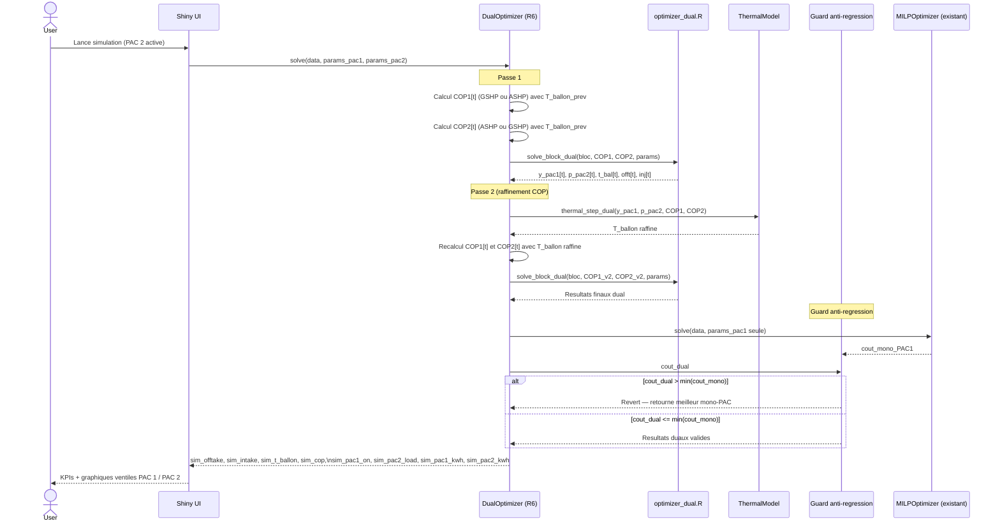
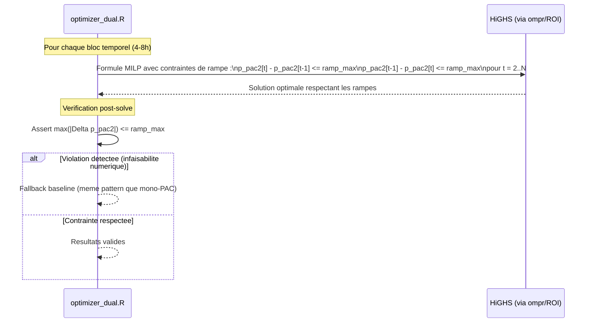
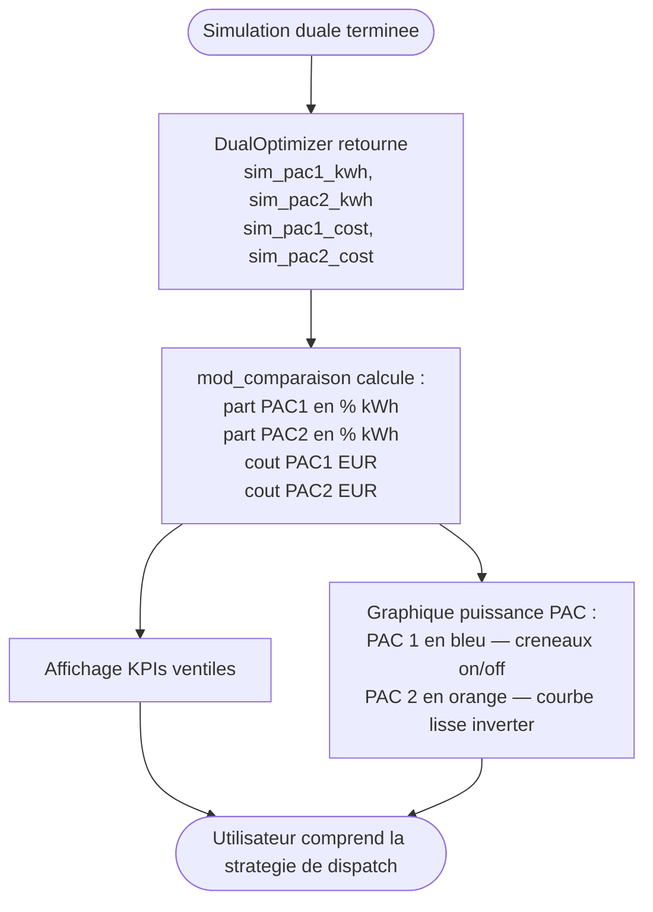
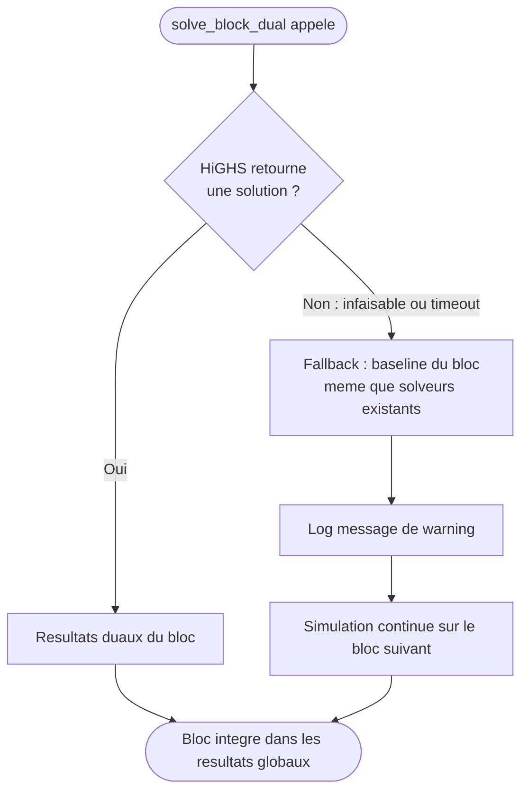

# Flows: Dual PAC Optimizer (ASHP+GSHP couple)

**Feature Branch**: `009-dual-pac-optimizer`
**Created**: 2026-05-21

## Flow 1: Configuration et activation de PAC 2 (US1 — P1)

L'utilisateur active une seconde PAC dans le sidebar et configure ses parametres. Ce flux couvre le chemin nominal et le chemin de desactivation (retrocompatibilite).

## Flow 2: Simulation et dispatch dual (US2 — P1)

L'optimiseur decide a chaque quart d'heure quelle PAC utiliser, en minimisant le cout total sur l'horizon de simulation. Deux passes de raffinement COP sont effectuees.

## Flow 3: Lissage inverter — validation de la contrainte de rampe (US3 — P1)

Ce flux illustre comment la contrainte de rampe garantit des transitions progressives pour une PAC en mode inverter.

## Flow 4: Affichage de la ventilation PAC 1 / PAC 2 (US4 — P2)

Apres une simulation duale, l'utilisateur consulte la repartition des contributions energetiques et financieres.

## Flow 5: Chemin d'erreur — bloc infaisable (Edge case)

Quand le solveur dual ne trouve pas de solution feasible pour un bloc temporel, le fallback baseline s'applique.

