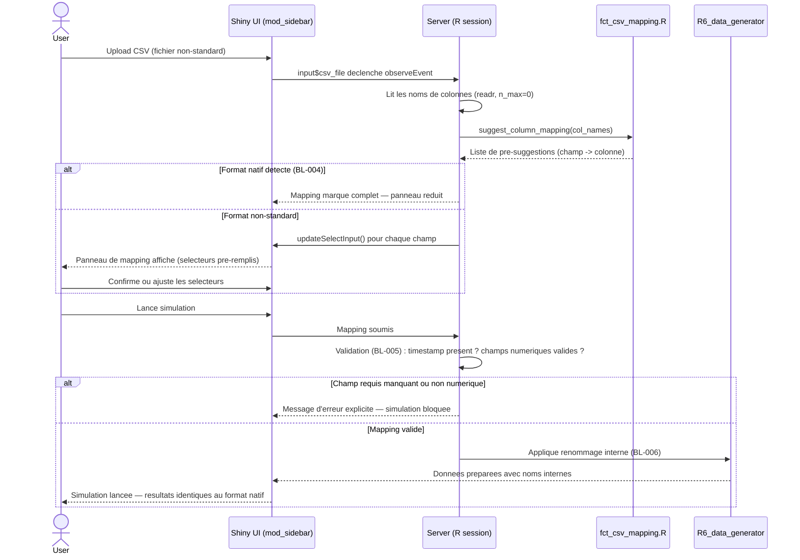
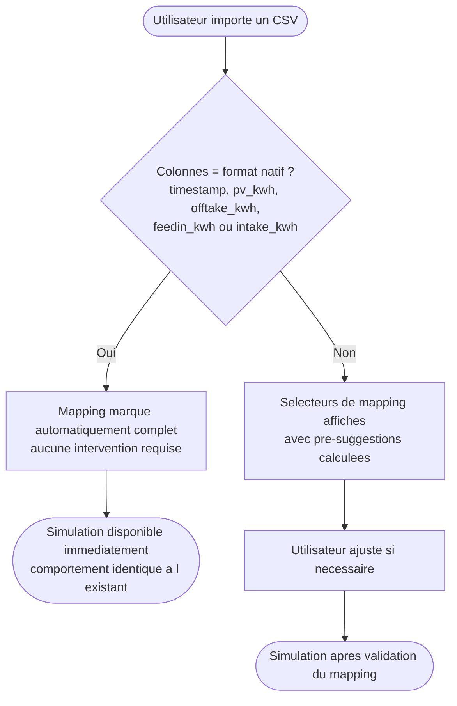
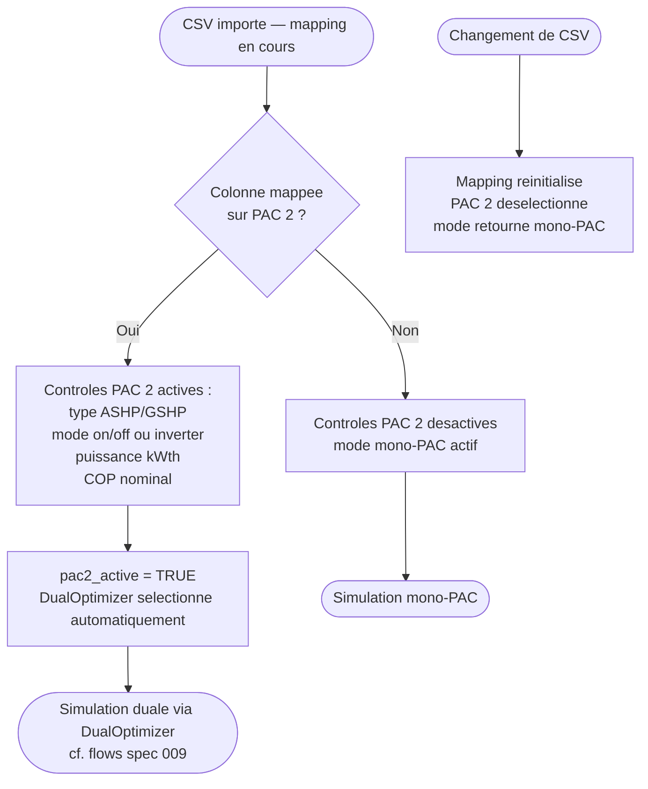
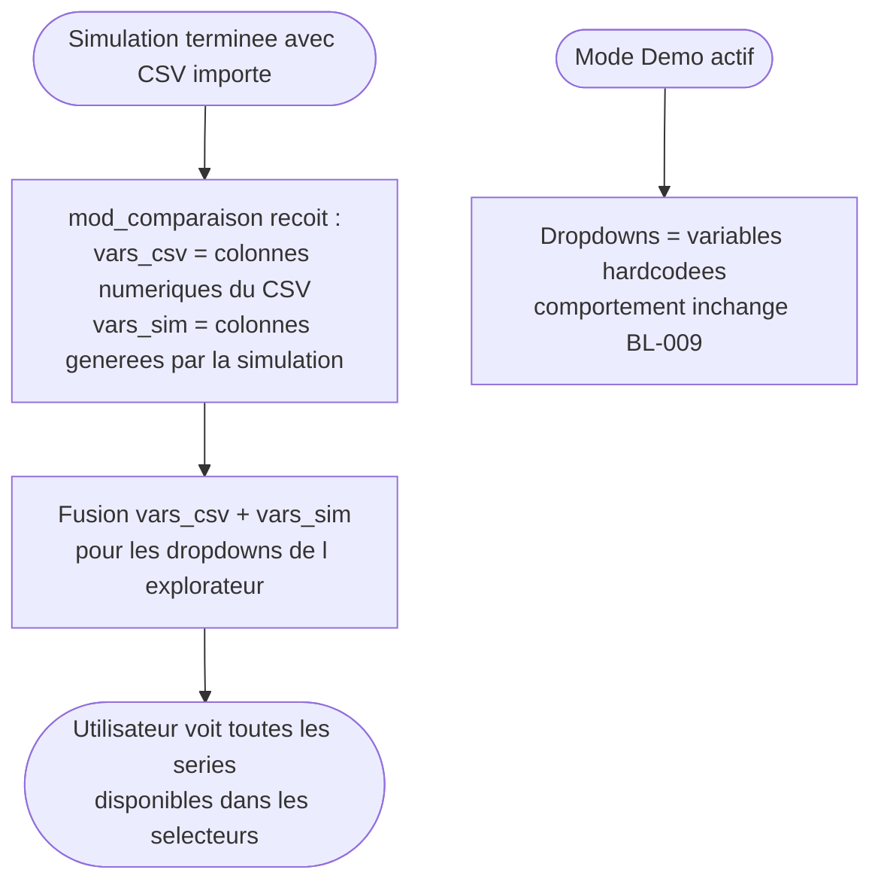
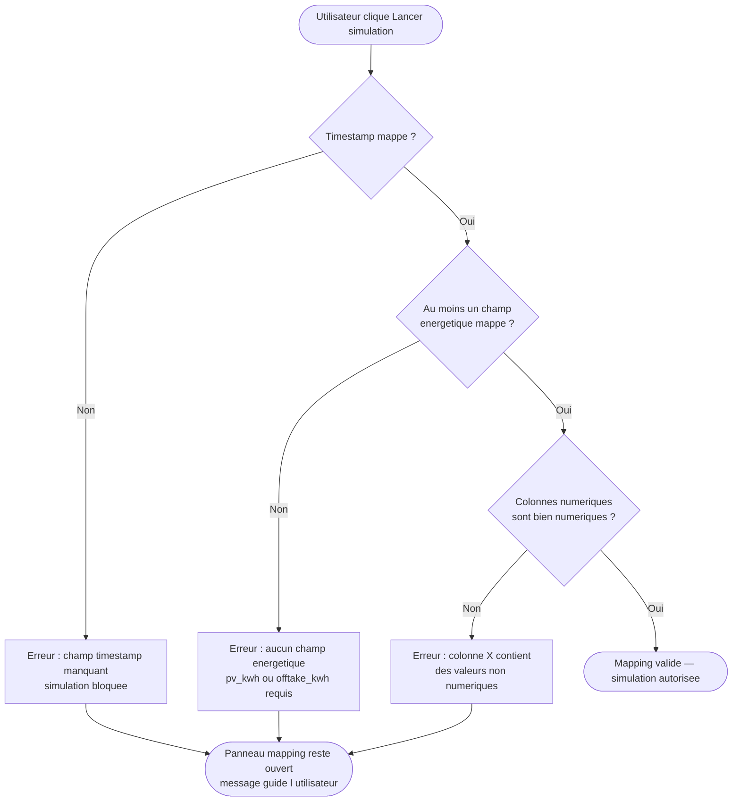

# Flows: CSV Column Mapping dynamique

**Feature Branch**: `010-csv-column-mapping`
**Created**: 2026-06-02

## Flow 1: Import CSV et pre-suggestion du mapping (US1 + US2 — P1)

L'utilisateur importe un CSV aux noms de colonnes non-standard. Le systeme detecte les colonnes, applique le matching par mots-cles, pre-remplit les selecteurs, et l'utilisateur confirme ou ajuste avant de lancer la simulation.

## Flow 2: Retrocompatibilite — CSV au format natif (US1 scenario 2 — P1)

Un utilisateur qui importe un CSV dont les colonnes correspondent exactement au format attendu ne voit aucune difference de comportement par rapport a l'existant.

## Flow 3: Configuration PAC et activation du mode dual (US3 — P2)

Quand l'utilisateur mappe une colonne sur PAC 2, les controles de configuration deviennent disponibles et le mode dual s'active automatiquement.

## Flow 4: Explorateur de donnees avec colonnes reelles (US4 — P2)

Apres import d'un CSV, l'explorateur propose les colonnes reelles du fichier dans ses dropdowns, en complement des variables simulees.

## Flow 5: Chemin d'erreur — champ requis non mappe (Edge case)

Quand l'utilisateur tente de lancer la simulation sans avoir mappe le timestamp ou un champ energetique, le systeme bloque et guide l'utilisateur.

